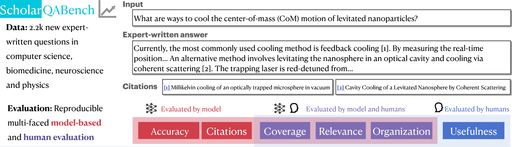

# ScholarQABench

This repository contains **ScholarQABench** evaluation script and data, which provides a holistic evaluation platform to test LLMs' abilities of assisting researchers to conduct scientific literature synthesis. This work is from the [OpenScholar](https://github.com/AkariAsai/OpenScholar) project. See details in [our manuscript](https://openscholar.allen.ai/paper). 



**Change logs** 

- November 19 2024: Initial release. 

**Table of Contents**

1. [Overview and Installation](#overview-and-installation)
2. [Evaluations](#evaluations)
3. [License](#license)
4. [Citations](#citations)


## Overview and Installation
### Setup

```python
conda create -n sb_env python=3.10.0
conda activate sb_env
pip install -r requirements.txt
python -m nltk.downloader punkt_tab
``` 

### Repository Organizations

- [data](data/): provides relevant data files. 
    - [scholar_cs](data/scholarqa_cs): includes **ScholarQA-CS** (Computer Science) data files
        - `output_snippets.jsonl` : Contains the questions with system responses for eval (and some other metadata used to generate the test cases but not required for subsequent runs). Should not require further modification.
        - `test_configs_snippets.json` : A collection of test cases in json format with associated rubrics for each question. Each question has its own test case and rubrics. Should not require further modification.
        - `qa_metadata_all.jsonl` : Metadata file that was used to bootstrap this utility. Should not require further modification.
        - `src_answers`: Directory containing sample system responses from 4 systems.

    - [scholar_multi](scholar_multi): includes **ScholarQA-Multi** (Multi-domain; CS, Bio and Physics) data files
    - [scholar_bio](scholar_bio): includes **ScholarQA-Bio** (Biomedicine) data files
    - [scholar_neuro](scholar_neuro): includes **ScholarQA-Neuro** (Neuroscience) data files
    - [single_paper_tasks](single_paper_tasks): includes **SciFact**, **PubmedQA** and **QASA**. 
        - `scifact_test.jsonl`: a jsonlines file includes the SciFact task data. Each item consists of `input` (original claim), `answer` (answer label, `true` or `false`), and `gold_ctx` (a list of dictionary where each item consists of `title` and `text`). `gold_ctx` will not be used during evaluation except for oracle gold context evaluation. 
        - `pubmed_test.jsonl`: a jsonlines file includes the PubMed task data. Each item consists of `input` (original question), `answer` (answer label, `yes` or `no`), and `gold_ctx` (a list of dictionary where each item consists of `title` and `text`). `gold_ctx` will not be used during evaluation except for oracle gold context evaluation. 
        - `qasa_test.jsonl`: a jsonlines file includes the QASA task data. Each item consists of `input` (question), `answer` (long-form answer), `ctxs` (a list of dictionary items for the full paper data) and `gold_ctxs` (a list of dictionary items where each item consists of `title` and `text` for gold contexts). `gold_ctxs` will not be used during evaluation except for oracle gold context evaluation. 
- [scripts](scripts/): provides evaluation scripts for each evaluation aspects
    - [rubric_eval.py](scripts/rubric_eval.py): a script to run rubric based evaluations for **ScholarQA-CS**. 
    - [citation_correctness_eval.py](scripts/citation_correctness_eval.py): a script to run citations as well as string-matching-based correctness evaluations for single-paper tasks. 
    - [prometheus_eval.py](scripts/prometheus_eval.py): a script to evaluate *organization*, *relevance* and *coverage*, based on five-scale rubrics in [rubrics](rubrics/prometheous_rubrics_v8.json)
- [rubrics](rubrics): rubrics for `prometheus_eval`. 

The availability of annotations, as well as overview of the annotations are summarized below. Note that ScholarQA-Bench does not provide training data. 

| Dataset    | Input | Output | Label Available | Evaluation Metrics |
| :-------- | :-------: |:-------: | :-------: | :-------: |
| `ScholarQA-SciFact`  |  claim   | `true` or `false` |  ✅ | `accuracy`, `citations_short` |
| `ScholarQA-PubmedQA`  |  question   | `yes` or `no` | ✅  | `accuracy`, `citations_short` |
| `ScholarQA-QASA`  |  question   | long-form |  ✅ | `rouge-l`, `citations` |
| `ScholarQA-CS`  |  question   | long-form |  ✅ (rubrics) | `rubrics`, `citations` |
| `ScholarQA-Multi`  |  question   | long-form |  ✅ | `prometheus`, `citations` |
| `ScholarQA-Bio`  |  question   | long-form |  | `citations` |
| `ScholarQA-Neuro`  |  question   | long-form | |  `citations` |


## Evaluations
After you run model inferences, run evaluations for each task and aspects using the following scripts. 

Your answer files for all tasks are expected to format in the following way (`json``) 
```
[
{"input": query (str), "output": final_model_output (str), "ctxs: citations (list of    dict, where each dict has text )}, ...
]
```

### Citation Accuracy (All tasks) 

#### Short-form generation (SciFact, PubMedQA)

```
python citation_correctness_eval.py --f PATH_TO_YOUR_PREDICTION_FILE --citations_short
```


#### Long-form generation (QASA, ScholarQA-*)

```
python citation_correctness_eval.py --f PATH_TO_YOUR_PREDICTION_FILE --citations_long
```


### String-based Correctness (SciFact, PubmedQA, QASA)
To run string based evaluations, run the following commands:

#### SciFact and PubMedQA (accuracy)

```
python citation_correctness_eval.py --f PATH_TO_YOUR_PREDICTION_FILE --match
```

#### QASA (ROUGE-L)

```
python citation_correctness_eval.py --f PATH_TO_YOUR_PREDICTION_FILE
```


### Rubric-based Correctness (ScholarQA-CS)

#### Convert the output file
To run eval for your system, first setup the prediction file with the system answers to be evaluated as per following requirement:

A jsonl file with fields `case_id` and `answer_text` (See [example file](https://github.com/allenai/multidoc_qa_eval/blob/main/data/src_answers/gpt.jsonl)) -

- `case_id` corresponds to the identifier of the question for which the response is to be evaluated, map the question text with the case_id in `test_configs_snippets.json`
- `answer_text` is the system answer (along with citations and excerpts, if applicable) in plain text

We provide an answer conversion script, [`convert_answer_nora.py`](scripts/convert_answer_nora.py), which convert the original answer file to the expected format. 

```
python scripts/convert_answer_nora.py \
    --pred_file YOUR_PRED_FILE_NAME \
    --data_file data/scholar_cs/test_configs_snippets.json \
    --output_file scholar_cs/src_answers/CONVERTED_OUTPUT_FILE_NAME
```

##### Run evaluation 
Once the prediction json file is ready, save it a new directory run the eval script as follows (You can save as many system response files under a directory, they will be picked together for eval):

```python
export OPENAI_API_KEY=<openai key>
python scripts/rubric_eval.py \
    --qa-dir data/scholarqa_cs/src_answers \
    --test-config data/scholarqa_cs/test_configs_snippets.json \
    --rubrics --snippets \
    --src-names <optional comma separated src names prefixes of prediction files with .jsonl, if not given all the files will be picked>
```
**Note:** To evaluate only using rubrics, remove `--snippets` parameter and vice-versa to use only snippets. 

**Acknowledgements:** The original code of the ScholarQA-CS are available at [allenai/multidoc_qa_eval](https://github.com/allenai/multidoc_qa_eval).

### Prometheus for Coverage, Relevance and Organization (ScholarQA-CS)

#### Coverage and Organization

```
python scripts/prometheus_eval.py \
    --batch_process_dir YOUR_PREDICTION_FILE_PATH \
    --output_path OUTPUT_DIR_NAME \
    --rubric_path rubrics/prometheus_rubrics_v8.json \
    --instruction "Answer the question related to the most recent scientific literature." \
    --model prometheus-eval/prometheus-7b-v2.0 \
    --load_vllm \
    --top_n 10 \
    -f data/scholar_multi/human_answers.json \
    --aspects organization coverage
```

#### Relevance 
We use `prometheus-eval/prometheus-8x7b-v2.0` for relevance, due to unstable performance of `prometheus-eval/prometheus-bgb-8x7b-v2.0` for relevance. 

```
python scripts/prometheus_eval.py \
    --batch_process_dir YOUR_PREDICTION_FILE_PATH \
    --output_path OUTPUT_DIR_NAME \
    --rubric_path rubrics/prometheus_rubrics_v8.json \
    --instruction "Answer the question related to the most recent scientific literature." \
    --model prometheus-eval/prometheus-bgb-8x7b-v2.0 \
    --load_vllm \
    --top_n 10 \
    -f data/scholar_multi/human_answers.json \
    --aspects relevance
```

## License
The aggregate test cases, sample system answers under `data/src_answers` and other files under data directory are released under [ODC-BY](https://opendatacommons.org/licenses/by/1.0/) license. 
By downloading this data you acknowledge that you have read and agreed to all the terms in this license.
For constituent datasets, also go through the individual licensing requirements, as applicable. 


## Citations
```
@article{openscholar,
  title={{OpenScholar}: Synthesizing Scientific Literature with Retrieval-Augmented Language Models},
  author={Asai, Akari and He*, Jacqueline and Shao*, Rulin and Shi, Weijia and Singh, Amanpreet and Chang, Joseph Chee  and Lo,  Kyle and Soldaini, Luca and Feldman, Tian, Sergey and Mike, D’arcy and Wadden, David and Latzke, Matt and Minyang and Ji, Pan and Liu, Shengyan and Tong, Hao and Wu, Bohao and Xiong, Yanyu and Zettlemoyer, Luke and Weld, Dan and Neubig, Graham and Downey, Doug and Yih, Wen-tau and Koh, Pang Wei and Hajishirzi, Hannaneh},
  journal={Arxiv},
  year={2024},
}
```
